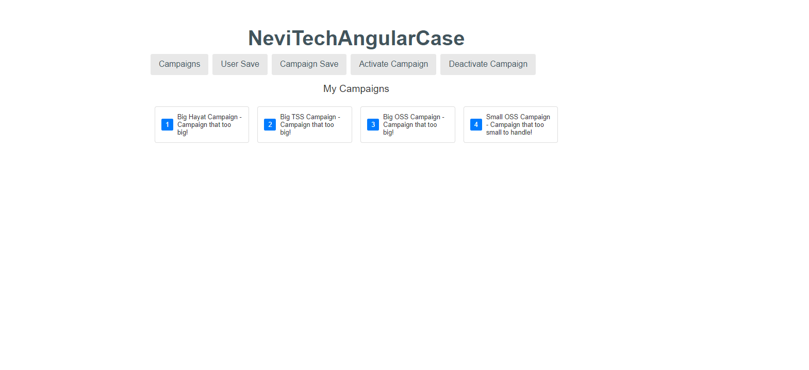
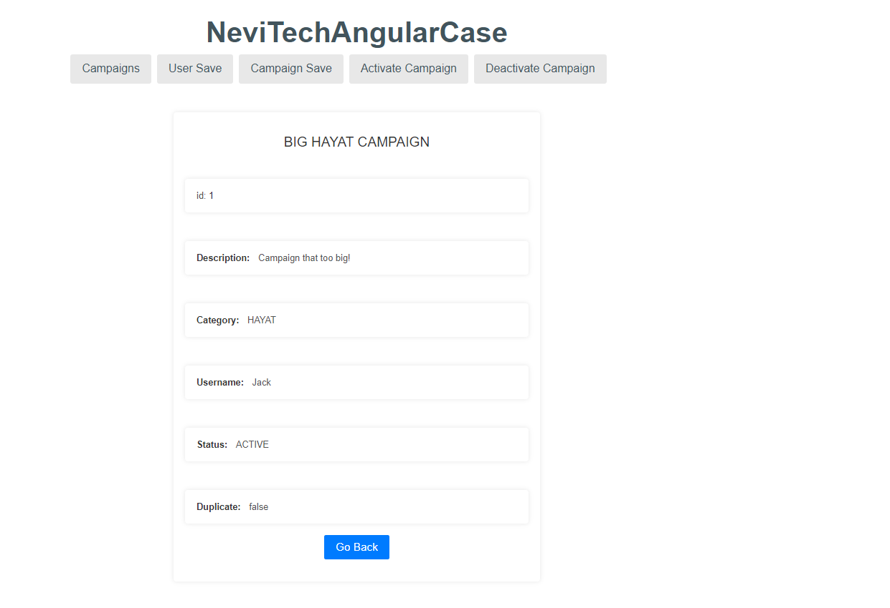
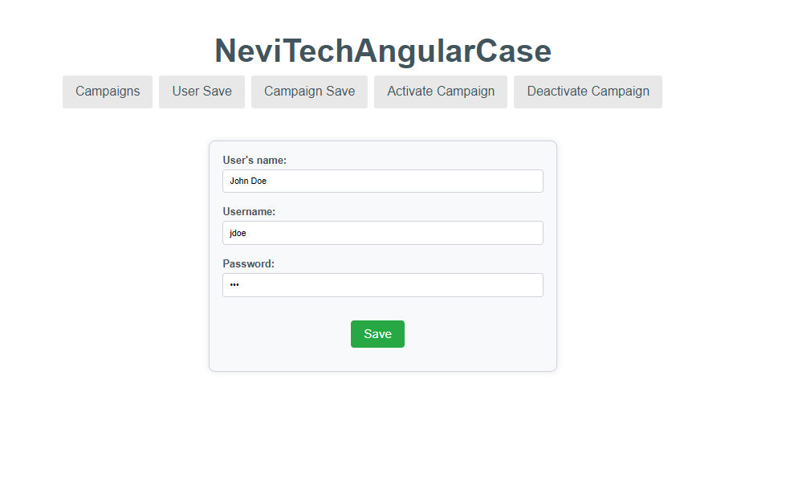
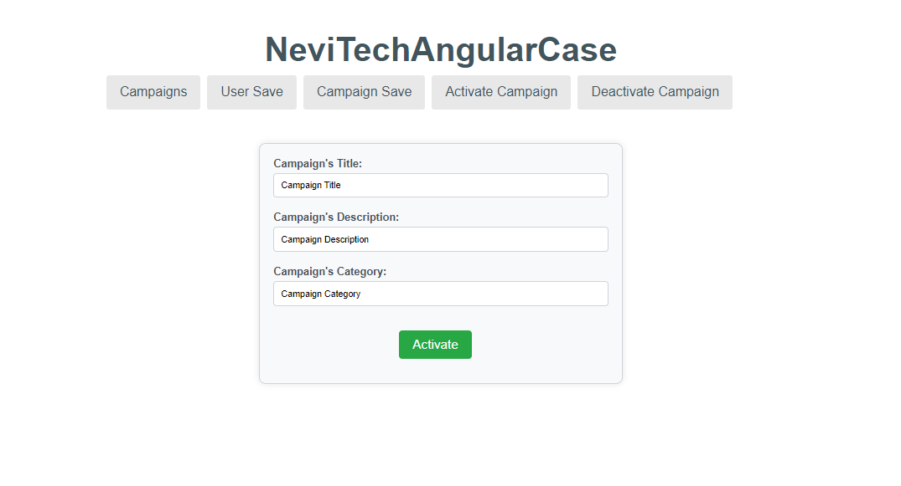
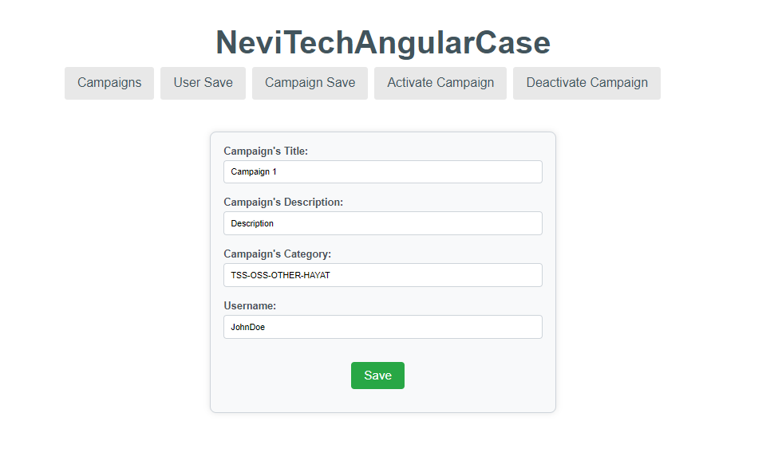

<a name="readme-top"></a>

<details>
  <summary>Table of Contents</summary>
  <ol>
    <li>
      <a href="#about-the-project">About The Project</a>
    </li>
    <li>
      <a href="#getting-started">Getting Started</a>
    </li>
    <li><a href="#built-with">Built With</a></li>
    <li><a href="#usage">Usage</a></li>
    <li><a href="#contributing">Contributing</a></li>
    <li><a href="#contact">Contact</a></li>
  </ol>
</details>


## About The Project

NeviTechInternshipCase is a web application that manages campaigns. It allows users to create, activate, deactivate campaigns, and view their status history.
The project follows modern software development practices, leveraging Spring Boot for backend development, Spring Data JPA for data persistence, and a RESTful API for communication.
And this project is frontend of NeviTechInternshipCase and it developed using Angular 17 to make the project more up-to-date.

This is the API that I developed for my internship at NeviTech.

<p align="right">(<a href="#readme-top">back to top</a>)</p>

## Getting Started

### Prerequisites

Before you begin, make sure you have the following prerequisites:

* NodeJS.
* Visual Studio Code

### Installation Steps

#### Clone the Repository:

Start by cloning the NeviTechInternshipCase repository to your local machine.

```
git clone https://github.com/Kinto2517/NeviTechInternshipCase.git
```

#### Run The Project With Your IDE and Terminal:

Open a terminal in the root directory where you cloned the repository.

Run `ng serve` for a dev server. Navigate to `http://localhost:4200/`. The application will automatically reload if you change any of the source files.

<p align="right">(<a href="#readme-top">back to top</a>)</p>

## Built With

* 
* 
* 
  
<p align="right">(<a href="#readme-top">back to top</a>)</p>


## Usage

* This frontend application seamlessly integrates with the backend API, providing a visual representation of the various API calls directly within the browser interface.

* Through implementation, the project establishes a communication with the backend, enabling the display of essential API calls within the browser.
  
* Noteworthy functionalities include CampaignList, CampaignDetail, UserSave, CampaignActivate, and CampaignSave, all effortlessly accessible and navigable from the frontend.







<p align="right">(<a href="#readme-top">back to top</a>)</p>


## Contributing

Contributions are what make the open source community such an amazing place to learn, inspire, and create. Any contributions you make are **greatly appreciated**.

If you have a suggestion that would make this better, please fork the repo and create a pull request. You can also simply open an issue with the tag "enhancement".
Don't forget to give the project a star! Thanks again!

1. Fork the Project
2. Create your Feature Branch (`git checkout -b feature/AmazingFeature`)
3. Commit your Changes (`git commit -m 'Add some AmazingFeature'`)
4. Push to the Branch (`git push origin feature/AmazingFeature`)
5. Open a Pull Request

<p align="right">(<a href="#readme-top">back to top</a>)</p>


## Contact

* Ersin Yılmaz ASLAN - [My LinkedIn](https://tr.linkedin.com/in/ersinya)
* Project Link: [NeviTech Internship Case Frontend](https://github.com/Kinto2517/NeviTechInternshipAngular)

<p align="right">(<a href="#readme-top">back to top</a>)</p>
